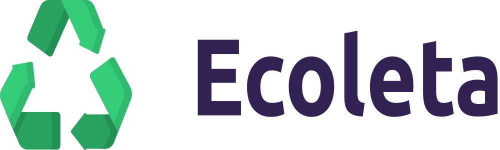

# Ecoleta

#### Helping you to find your closest recycling point! 

<p align="center">
  
  
  <a href="https://github.com/twistershark/ecoleta/commits/master">
    
  </a>

  

</p>

## Getting Started

This project was developed during the NLW, a bootcamp provided by Rocketseat to help us achieve the next level, while learning a complete stack that help us develop the back-end, front-end and mobile versions of an app using Javascript. 

The following instructions will get you a copy of the app up and running on your local machine. 

## Prerequisites

What things you need to install the software and how to install them:

__NodeJS__ (Version 12 or newer)

## How to execute the project

#### Back-end:
First of all, you need to be running the server while you use the web and mobile versions off the project. Just navigate to the _server_ folder with your terminal and execute: ```npm install``` to install every dependency, then execute the following command to start the server: ```npm run dev```.

#### Web / Mobile:
Enter web or mobile folder and execute the following commands:
1. ```npm install``` (Installs every dependency needed)
2. ```npm start```


## Built With

* [NodeJS](https://nodejs.org/en/) - designed to build scalable network applications
* [ReactJS](https://reactjs.org/) - A JavaScript library for building user interfaces
* [React Native](https://reactnative.dev/) - A JavaScript library for developing native apps(iOS and Android)
* [Expo](https://expo.io/) - A module that give us access to a lot of cool stuff while developing React Native apps.
* [TypeScript](https://www.typescriptlang.org/) - TypeScript is a typed superset of JavaScript that compiles to plain JavaScript.

## Contributing

Feel free to contribute to this project. Every help is welcome!


## License

This project is licensed under the MIT License - see the [LICENSE.md](LICENSE.md) file for details

## Acknowledgments

* Thanks Rocketseat for providing this epic bootcamp for free.
